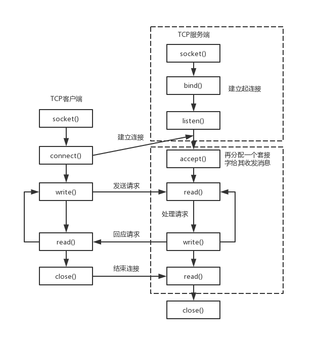

设计思路是开启一个Server端，异步接受连接并将连接转移给具体的HttpConnection对象来管理



## CServer

boost封装了上面图片中的socket/bind/listen/accept等函数，创建类Cserver如下：

```c++
namespace beast = boost::beast;         // from <boost/beast.hpp>
namespace http = beast::http;           // from <boost/beast/http.hpp>
namespace net = boost::asio;            // from <boost/asio.hpp>
using tcp = boost::asio::ip::tcp;       // from <boost/asio/ip/tcp.hpp>

class CServer : public std::enable_shared_from_this<CServer>
{
public:
    // io_context类似于一个EventLoop, 注册 / 监听 / 回调事件
    CServer(boost::asio::io_context& ioc, unsigned short& port);
    void start();
private:
    tcp::acceptor acceptor_;
    net::io_context& ioc_;
    tcp::socket socket_;
};
```

1. io_context是一个事件循环类型，监听注册在上面的所有事件并在事件触发时调用事先注册的回调函数
2. acceptor是server端的接受连接类型，通常用一个io_context和endpoint（服务端ip地址和端口）来初始化，并将acceptor注册到io_context上
3. socket封装了原本的套接字，用于网络读写

### 初始化

```c++
CServer::CServer(boost::asio::io_context& ioc, unsigned short& port)
    :ioc_(ioc),
    acceptor_(ioc, tcp::endpoint(tcp::v4(), port)),
    socket_(ioc) {
    // io_context无拷贝构造和拷贝赋值
}
```

### 服务端开启监听

学习使用异步模型：

```c++
void CServer::start() {
    // 防止server对象析构
    auto self = shared_from_this();
    acceptor_.async_accept(socket_, [self](beast::error_code ec) {
            try {
                // 出错就放弃该连接, 继续监听其他连接
                if (ec) {
                    self->start();
                    return;
                }
                // 接受了新连接, 将socket交给具体的管理类去管理
                std::make_shared<HttpConnection>(std::move(self->socket_))->start();
                // start();
                // HttpConnection(std::move(socket_));
                // 继续监听
                self->start();
            } catch (const std::exception&) {

            }
        });
}
```

acceptor使用async_accept函数向io_context事件循环中注册socket的读写事件和回调函数，io_context在启动事件循环后开启监听，当有socket上的读写事件发生时即调用之前注册的回调函数

CServer的start函数只完成向io_context上注册这一事件，在注册完毕后即刻返回，当io_context监听到socket有读写事件发生时调用注册过的回调函数，回调函数中接受连接并转交给HttpConnection对象进行管理，然后执行server的start函数，原socket_继续接受新的连接

## HttpConnection

该类用于管理连接过来的客户端socket并预处理http请求和回应

```c++
class HttpConnection : public std::enable_shared_from_this<HttpConnection>
{
public:
    friend class LogicSystem;
    HttpConnection(tcp::socket socket);
    void start();
private:
    void checkDeadLine();
    void writeResponse();
    void handleRequest();

    void parseGetParams();
    tcp::socket socket_;
    beast::flat_buffer buffer_{ 8192 };
    http::request<http::dynamic_body> request_;
    http::response<http::dynamic_body> response_;

    std::string get_url_;   // 带/不带参数的get方法的请求url
    std::unordered_map<std::string, std::string> get_params_;// get_url参数列表

    net::steady_timer deadline_{
        socket_.get_executor(),		// 将定时器绑定到socket_的调度器上(这里就是iocontext)
        std::chrono::seconds(60)
    };
};
```

1. buffer_: 接收数据
2. request_: 数据解析为http请求的形式
3. response_: 数据解析为http回应的形式，用于回应客户端
4. deadline_: 定时器，检查连接是否超时

### 初始化

CServer在调用HttpConnection构造函数时和HttpConnection都使用了**std::move**函数，该行为可以简易理解为**CServer::socket_**被重置了，而原先**CServer::socket_**中的数据被**move**到了HttpConnection::socket中：

```c++
// 构造函数
HttpConnection::HttpConnection(tcp::socket socket)
    : socket_(std::move(socket)) {

}
```

### Start

**CServer**在回调函数调用了HttpConnection的start函数：

shared_from_this()在这里很重要，因为在CServer的回调函数中，创建一个HttpConnection的智能指针，理论上来讲在回调结束后，智能指针会调用HttpConnection的析构函数，但是shared_from_this()会将shared_ptr的引用计数+1，使得CServer的回调函数中，HTTPConnection的智能指针不会自动析构，从而移交socket的管理权，而在HTTPConnection中，通过使用shared_from_this()的方式让shared_ptr的引用计数不断变化，直到HttpConnection对象注册的某个回调函数中引用计数降为0，自动析构：

```c++
void HttpConnection::start() {
    auto self = shared_from_this();
    http::async_read(socket_, buffer_, request_, [self](beast::error_code ec, std::size_t bytes_transferred) {
        try {
            if (ec) {
                std::cout << "http read err is " << ec.what() << std::endl;
                return;
            }
            boost::ignore_unused(bytes_transferred);
            // 处理http请求
            self->handleRequest();
            // 发送响应是否超时, 超时则关闭socket_
            self->checkDeadLine();
        }
        catch (const std::exception& exp) {
            std::cout << "exception is " << exp.what() << std::endl;
        }
    });
}
```

http::async_read介绍：

```c++
async_read(
    AsyncReadStream& stream,
    DynamicBuffer& buffer,
    message<isRequest, Body, basic_fields<Allocator>>& msg,
    ReadHandler&& handler)
```

1. stream：异步可读的数据流，可以理解为socket
2. buffer：用于存储接收的数据，http可接受文本，图像等各类型的数据，所以是DynamicBuffer
3. msg：请求参数，一般也要传递能接受多种资源类型的请求参数
4. handler：回调函数

HttpConnection处理http request流程：

1. 根据request请求方法区分(get/post)
2. LogicSystem处理具体请求逻辑
3. 设置response包
4. 发送response包
5. 启动定时器

### 处理request+响应

HttpConnection类负责从socket中读取和写入http数据，parse后的request则交由具体的逻辑类（LogicSystem）实现，见day06

```c++
// 发送响应
void HttpConnection::writeResponse() {
    auto self = shared_from_this();
    response_.content_length(response_.body().size());
    response_.prepare_payload();
    http::async_write(socket_, response_, [self](beast::error_code ec, std::size_t bytes_transferred) {
        // 关闭己方发送
        self->socket_.shutdown(tcp::socket::shutdown_send, ec);
        // 关闭定时器
        self->deadline_.cancel();
    });
}
void HttpConnection::handleRequest() {
    // 设置版本
    response_.version(request_.version());
    // 设置短连接
    response_.keep_alive(false);
    // 处理不同的请求方法
    if (request_.method() == http::verb::get) {
        // 过滤uri得到url和kv
        parseGetParams();
        // 具体逻辑交给LogicSystem类处理
        bool success = LogicSystem::getInstance()->handleGet(get_url_, shared_from_this());
        if (!success) {
            response_.result(http::status::not_found);
            response_.set(http::field::content_type, "text/plain; charset=utf-8");
            beast::ostream(response_.body()) << "url not found\r\n";
            writeResponse();
            return;
        }
        response_.set(http::field::content_type, "text/plain; charset=utf-8");
        response_.result(http::status::ok);
        response_.set(http::field::server, "GateServer");
        writeResponse();
        return;
    } else if (request_.method() == http::verb::post) {
        bool success = LogicSystem::getInstance()->handlePost(request_.target(), shared_from_this());
        if (!success) {
            response_.result(http::status::not_found);
            response_.set(http::field::content_type, "text/plain");
            beast::ostream(response_.body()) << "url not found\r\n";
            writeResponse();
            return;
        }
        response_.result(http::status::ok);
        response_.set(http::field::server, "GateServer");
        writeResponse();
        return;
    }
}
```

### 定时器

上述实现的http是短连接，发送完数据后，不需要再监听连接，直接断开发送端（在writeResponse中）。定时器是针对发送事件的，即服务器要在一定时间内发送完响应数据，否则超出一定时间内数据还没有被发送的话，说明当前连接过多处理不过来，此时直接关闭socket

```c++
void HttpConnection::checkDeadLine() {
    auto self = shared_from_this();
    deadline_.async_wait([self](beast::error_code ec) {
        if (!ec) {
            self->socket_.close();
        }
    });
}
```

### Http Get

**GET** 方法从指定的资源请求数据，比如localhost:8000/get_test，就是请求对应服务器上get_test下的资源，有时会带查询参数，如localhost:8000/get_test?key1=value1&key2=value2（?后面跟查询参数）

#### Http URL编解码

Http在处理非ASCII字符时，会将其转为%hex(character)的形式：

比如`中文1=值1`就会被转为`%e4%b8%ad%e6%96%871%3d%e5%80%bc1`

1. hex和dec互转：

   ```c++
   // 10转16
   unsigned char DecToHex(unsigned char x) {
       return x > 9 ? x + 55 : x + 48;
   }
   // 16转10
   unsigned char HexToDec(unsigned char x) {
       unsigned char y;
       if (x >= '0' && x <= '9') y = x - '0';
       else if (x >= 'A' && x <= 'F') y = x - 'A' + 10;
       else if (x >= 'a' && x <= 'f') y = x - 'a' + 10;
       else assert(0);
       return y;
   }
   ```

2. http url编码：对每一个char字符，如果非字母数字或特殊符号，将该8位数字转为% + 高4位16进制 + 低4位16进制

   http url解码：即上述的反过程

   ```c++
   // http url编码, 转换空格和其他非ascii字符
   std::string urlEncode(const std::string& str) {
       std::string encoded = "";
       size_t length = str.length();
       for (size_t i = 0; i < length; i++) {
           // 数字和字母不变
           if (isalnum((unsigned char)str[i]) ||
               (str[i] == '-') ||
               (str[i] == '_') ||
               (str[i] == '.') ||
               (str[i] == '~')) {
               encoded += str[i];
           } else if (str[i] == ' ') {
               // space变为'+'
               encoded += '+';
           } else {
               // 其他字符转换为%(高4位16进制)(低4位16进制)
               encoded += '%';
               encoded += DecToHex((unsigned char)str[i] >> 4);
               encoded += DecToHex((unsigned char)str[i] & 0x0F);
           }
       }
       return encoded;
   }
   // http url解码
   std::string urlDecode(const std::string& str) {
       std::string decoded = "";
       size_t length = str.length();
       for (size_t i = 0; i < length; i++) {
           if (str[i] == '+') {
               decoded += ' ';
           } else if (str[i] == '%') {
               assert(i + 2 < length);
               unsigned char high = HexToDec((unsigned char)str[++i]);
               unsigned char low = HexToDec((unsigned char)str[++i]);
               // unsigned char c = HexToDec(str[i + 1]);
               // c = (c << 4) + HexToDec(str[i + 2]);
               decoded += (char)(high * 16 + low);
               // i += 2;
           } else {
               decoded += str[i];
           }
       }
       return decoded;
   }
   ```

3. parse http url：对于一个形如`xxx?key1=value1&key2=value2`的url，目标是将?后面的查询参数保存下来。

   - `？`之前的url保存在`get_url`中
   - `?`之后的字符串根据`&`分割，并根据`=`分割出key值和value值，保存在map中
   - 对每一个键值对，都使用`urlDecode`对其解码

   ```c++
   void HttpConnection::parseGetParams() {
       // xxx?key1=value1&key2=value2
       auto uri = request_.target();
       auto q_pos = uri.find('?');
       // 找第一个?的位置, 没找到说明没有
       if (q_pos == std::string::npos) {
           get_url_ = urlDecode(uri);
           return;
       }
       // 否则url是uri[0 ~ q_pos-1], 键值对在uri[q_pos + 1 ~ end]
       get_url_ = urlDecode(uri.substr(0, q_pos));
       std::string query = uri.substr(q_pos + 1);
       // 遍历键值对, key和value都要decode
       size_t and_pos = 0;
       while ((and_pos = query.find('&')) != std::string::npos) {
           auto kv = query.substr(0, and_pos);
           size_t equal_pos = kv.find('=');
           if (equal_pos != std::string::npos) {
               std::string key = urlDecode(kv.substr(0, equal_pos));
               std::string value = urlDecode(kv.substr(equal_pos + 1));
               get_params_[key] = value;
           }
           query = query.substr(and_pos + 1);
       }
   
       if (!query.empty()) {
           size_t equal_pos = query.find('=');
           if (equal_pos != std::string::npos) {
               std::string key = urlDecode(query.substr(0, equal_pos));
               std::string value = urlDecode(query.substr(equal_pos + 1));
               get_params_[key] = value;
           }
       }
   }
   ```

最后由`LogicSystem`根据不同的url调用不同的逻辑处理函数

