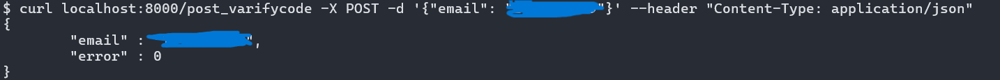

## Singleton

懒汉模式的单例类模板，方便子类继承使用

1. 构造函数在protect下，外部不能访问，子类中能访问
2. 使用shared_ptr创建实例指针，但不使用make_shared（需要在子类内设置shared_ptr的友元）
3. 如果使用静态局部变量，推荐创建shared_ptr（如果子类继承了enable_shared_from_this的话）

```c++
template<typename T>
class Singleton {
    // protect 使子类能够访问
protected:
    Singleton() = default;
    // 不允许拷贝赋值
    Singleton(const Singleton<T>&) = delete;
    Singleton operator = (const Singleton<T>& other) = delete;

    static std::shared_ptr<T> instance_;
public:
    static std::shared_ptr<T> getInstance() {
        // 只初始化1次
        static std::once_flag s_flag;
        std::call_once(s_flag, [&]() {
            // 要用make_shared, 需要在子类中设置友元, 否则会报访问错误
            // 在子类中将Singleton类设为友元, 可以new子类, 否则也会报错
            instance_ = std::shared_ptr<T>(new T);
            });
        return instance_;

    }
    /* 更简单的写法: (instance_就无用了)
    static shared_ptr<T> getInstance() {
        static std::shared_ptr<T> instance = std::shared_ptr<T>(new T);
        return instance;
    }
    */
    void printAddress() {
        std::cout << instance_.get() << std::endl;
    }
    ~Singleton() {
        std::cout << "This is Singleton destruction." << std::endl;
    }

};
// 类内static变量初始化
template<typename T>
std::shared_ptr<T> Singleton<T>::instance_ = nullptr;
```

## LogicSystem

LogicSystem用于处理具体的Http请求逻辑，继承于Singleton，在初始化时构造好各个url的处理函数

由HttpConnection对象传入client的访问路径和connection对象本身，处理request并构造应返回的response数据

- 前向声明：类A的.h文件用到了类B，类B的.h文件又用到了类A，此时为了解决相互引用的问题，做法是不在类的.h文件中#include，只进行class A/B进行声明，然后在各自的.cpp/.cc文件中include对方的.h文件

```c++
// 前向声明: 解决相互引用
class HttpConnection;
using HttpHandler = std::function<void(std::shared_ptr<HttpConnection>)>;

class LogicSystem : public Singleton<LogicSystem> {
    friend class Singleton<LogicSystem>;
public:
    ~LogicSystem();
    // path -> 处理哪个连接
    bool handlePost(std::string path, std::shared_ptr<HttpConnection> conn);
    // path -> 处理哪个连接
    bool handleGet(std::string path, std::shared_ptr<HttpConnection> conn);
    // 注册get请求的处理逻辑 : url -> get请求如何处理
    void registerGet(std::string url, HttpHandler handler);
    // 注册post请求的处理逻辑: url -> post请求如何处理
    void registerPost(std::string url, HttpHandler handler);
private:
    LogicSystem();
    std::map<std::string, HttpHandler> post_handler_;
    std::map<std::string, HttpHandler> get_handler_;
};
```

1. HttpHandler是一个函数指针，接受返回参数为void，参数类型为shared_ptr<HttpConnection>的类型
2. 将Singleton设置为友元，以便基类可以顺利的new出子类的对象
3. get_handler/post_handler是url和对应的逻辑处理函数
4. registerGet/Post向map中添加url和对应的逻辑处理函数
5. handleGet/Post是留给外部调用的接口，通常由HttpConnection对象调用

## 服务器和客户端Post通信

增加一个全局文件`constant.h`，定义一个枚举类型ErrorCodes，用于返回错误码：

```c++
#include <boost/beast/http.hpp>
#include <boost/beast.hpp>
#include <boost/asio.hpp>
#include <memory>
#include <map>
#include <unordered_map>
#include <iostream>
#include "header/singleton.h"
#include <json/json.h>
#include <json/value.h>
#include <json/reader.h>

namespace beast = boost::beast;         // from <boost/beast.hpp>
namespace http = beast::http;           // from <boost/beast/http.hpp>
namespace net = boost::asio;            // from <boost/asio.hpp>
using tcp = boost::asio::ip::tcp;       // from <boost/asio/ip/tcp.hpp>

// 错误码和错误类型
enum ErrorCodes {
    SUCCESS = 0,
    ERROR_JSON = 1001,  // JSON解析失败
    RPC_FAILED = 1002,  // RPC请求失败
};
```

### 服务器获取JSON数据

通过register功能添加一个post请求的处理逻辑：

1. Json::Value是一个保存json类型的类，支持[]查找赋值等
2. Json::Reader是一个读取字符串并保存为json类型的类
3. Json::Value::asString()可以将一个键值对的值（不能是嵌套的json，只能是普通类型，如int，double）转为字符串
4. Json::Value::toStyleString()可以将整个json数据格式化为json字符串

服务器在收到客户端的post请求后，将请求的body部分转为字符串，利用Json::Reader将字符串格式化为json数据，然后逐一判断是否有缺失的成员，在检查无错后，将回复的json再转为字符串写入响应中

```c++
registerPost("/post_varifycode", [](std::shared_ptr<HttpConnection> connection) {
        // 将body转为string类型
        auto body_string = boost::beast::buffers_to_string(connection->request_.body().data());
        std::cout << "post_varifycode received: " << body_string << std::endl;
        // 回复JSON数据
        connection->response_.set(http::field::content_type, "text/json");
        Json::Value request_json, response_json;
        Json::Reader reader;
        bool parse_success = reader.parse(body_string, request_json);
        // 将body格式化为json放入request_json中, 检查成功和email是否是其成员
        if (!parse_success || !request_json.isMember("email")) {
            std::cout << "Failed to parse request json!" << std::endl;
            response_json["error"] = ErrorCodes::ERROR_JSON;
            std::string response_string = response_json.toStyledString();
            beast::ostream(connection->response_.body()) << response_string;
            return true;
        }
        // asString将json的某一键的值转为字符串
        // toStyleString转换整个json到字符串
        auto email = request_json["email"].asString();
        std::cout << "post request: email is " << email << std::endl;
        response_json["error"] = ErrorCodes::SUCCESS;
        response_json["email"] = request_json["email"];
        std::string response_string = response_json.toStyledString();
        beast::ostream(connection->response_.body()) << response_string;
        return true;
    });
```

#### post测试

使用系统自带的命令行工具curl：

```
curl localhost:8000/post_varifycode -X POST -d '{"email": "xxx"}' --header "Content-Type: application/json"
```

若能收到返回的响应，并且响应是一个json数据即为成功：



### 客户端发送post请求

在registerdialog.cpp中的void RegisterDialog::on_get_code_clicked()修改逻辑：

当邮箱通过了正则表达式的过滤后，就调用HttpManager的postHttpReq方法

```c++
void RegisterDialog::on_get_code_clicked()
{
    auto email = ui->email_edit->text();
    QRegularExpression regex(R"((\w+)(\.|_)?(\w*)@(\w+)(\.(\w+))+)");
    bool match = regex.match(email).hasMatch();
    if (match) {
        // 发送验证码
        showTip(tr("请求发送中..."), true);
        QJsonObject post_json;
        post_json["email"] = email;
        HttpManager::getInstance()->postHttpReq(QUrl("http://	localhost:8000/post_varifycode"),
                                                post_json, ReqId::ID_GET_VARIFY_CODE, Modules::REGISTERMOD);


    } else {
        showTip(tr("邮箱地址不正确"), false);
    }
}
```

## 客户端配置管理

在Qt项目中添加新建项，并添加新文件config.ini，内容如下：

```
[GateServer]
host=localhost
port=8000
```

由[]标识一个域，例如host和port都是GateServer域下的属性


程序编译后会输出到bin目录，所以在pro文件中添加下面的内容以便可执行文件能够正确的找到config的位置：

```
win32:CONFIG(debug, debug | release)
{
    #指定要拷贝的文件目录为工程目录下release目录下的所有dll、lib文件，例如工程目录在D:\QT\Test
    #PWD就为D:/QT/Test，DllFile = D:/QT/Test/release/*.dll
    TargetConfig = $${PWD}/config.ini
    #将输入目录中的"/"替换为"\"
    TargetConfig = $$replace(TargetConfig, /, \\)
    #将输出目录中的"/"替换为"\"
    OutputDir =  $${OUT_PWD}/$${DESTDIR}
    OutputDir = $$replace(OutputDir, /, \\)
    //执行copy命令
    QMAKE_POST_LINK += copy /Y \"$$TargetConfig\" \"$$OutputDir\"
}
```

然后在global.h中添加声明：`extern QString gate_server_prefix;`

并在global.cpp中添加定义：`QString gate_server_prefix = "";`

在main函数中添加解析配置载入的逻辑：

```c++
QString app_path = QCoreApplication::applicationDirPath();
QString file_name = "config.ini";
QString config_path = QDir::toNativeSeparators(app_path + QDir::separator() + file_name);

QSettings settings(config_path, QSettings::IniFormat);
QString gate_host = settings.value("GateServer/host").toString();
QString gate_port = settings.value("GateServer/port").toString();

gate_server_prefix = "http://" + gate_host + ":" + gate_port;
```

之后在请求时使用`gate_server_prefix`来替换`http://localhost:8000`此类的字符串即可
