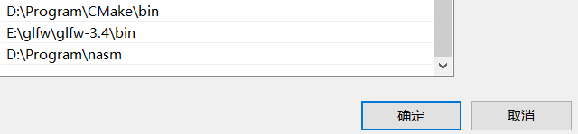
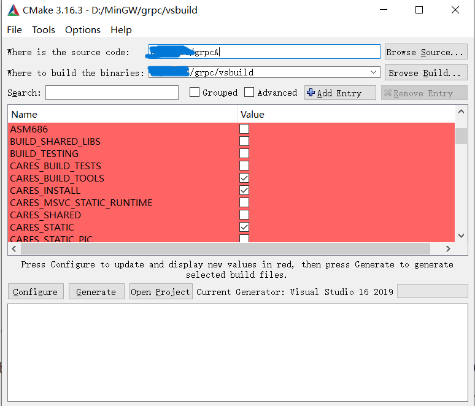

## 使用cmake配置项目

项目组织结构如下:

```
server
	--cmake
		third_party.cmake #编写第三方库的cmake配置文件
	--src
		--header #自己编写的头文件
		--source #自己编写的源文件
		CMakeLists.txt # src下的CMake配置
	--third_party #存放第三方库
		--json_cpp 
	CMakeLists.txt #根目录的CMake配置
	config.json #项目配置文件
	message.proto #生成rpc通信的文件
```

将第三方库，如下载后的`json_cpp`文件夹放入到`third_party`文件目录下，`boost`和将要配置的`grpc`由于原文件太大不建议直接这么导入，会大大增加编译时间，对于一些比较小的三方库可以直接放在`third_party`下，其他的则在电脑上编译完毕后在`cmake`文件夹下的`third_party.cmake`中导入。

根目录的`CMakeLists.txt`：

```cmake
cmake_minimum_required(VERSION 3.30)
project(server)

set(CMAKE_CXX_STANDARD 20)

set(EXECUTABLE_OUTPUT_PATH ${PROJECT_SOURCE_DIR}/) #让可执行文件生成在根目录下
add_subdirectory(src)
```

`cmake`文件夹下的`CMakeLists`：

```cmake
# jsoncpp
include_directories(${CMAKE_SOURCE_DIR}/third_party/jsoncpp-1.9.6/include)
set(JSONCPP_SRC
        ${CMAKE_SOURCE_DIR}/third_party/jsoncpp-1.9.6/src/lib_json/json_reader.cpp
        ${CMAKE_SOURCE_DIR}/third_party/jsoncpp-1.9.6/src/lib_json/json_value.cpp
        ${CMAKE_SOURCE_DIR}/third_party/jsoncpp-1.9.6/src/lib_json/json_writer.cpp
)


# boost
set(BOOST_ROOT "boost1_84_0") # 换成自己的boost路径
set(BOOST_INCLUDEDIR "${BOOST_ROOT}/include")
set(BOOST_LIBRARYDIR "${BOOST_ROOT}/lib")
set(Boost_NO_SYSTEM_PATHS ON)

find_package(Boost 1.84.0 REQUIRED COMPONENTS system filesystem thread)

if(Boost_FOUND)
    # 手动修正包含目录路径
    set(Boost_INCLUDE_DIRS "${BOOST_ROOT}/include")
    set(BOOST_LIB_DIR "${BOOST_ROOT}/lib")
    message(STATUS "=== Boost Information ===")
    message(STATUS "Boost version: ${Boost_VERSION}")
    message(STATUS "Original Boost include dirs: ${Boost_INCLUDE_DIRS}")
    message(STATUS "Boost libraries: ${Boost_LIBRARIES}")
    message(STATUS "Boost library dirs: ${Boost_LIBRARY_DIRS}")

    # 验证路径是否存在
    if(EXISTS "${Boost_INCLUDE_DIRS}")
        message(STATUS "✓ Boost include directory exists")
    else()
        message(WARNING "✗ Boost include directory does not exist: ${Boost_INCLUDE_DIRS}")
    endif()

    if(EXISTS "${Boost_INCLUDE_DIRS}/boost")
        message(STATUS "✓ Boost headers found")
    else()
        message(WARNING "✗ Boost headers not found in: ${Boost_INCLUDE_DIRS}/boost")
    endif()
    # 包含目录
    include_directories(${Boost_INCLUDE_DIRS})
endif()

# grpc
set(GRPC_ROOT "grpc") # 换成自己的grpc路径
include_directories(${GRPC_ROOT}/third_party/re2)
include_directories(${GRPC_ROOT}/third_party/address_sorting/include)
include_directories(${GRPC_ROOT}/third_party/abseil-cpp)
include_directories(${GRPC_ROOT}/third_party/protobuf/src)
include_directories(${GRPC_ROOT}/include)

set(GRPC_LIB_DIR
        ${GRPC_ROOT}/vsbuild/third_party/re2/Debug
        ${GRPC_ROOT}/vsbuild/third_party/abseil-cpp/absl/types/Debug
        ${GRPC_ROOT}/vsbuild/third_party/abseil-cpp/absl/synchronization/Debug
        ${GRPC_ROOT}/vsbuild/third_party/abseil-cpp/absl/status/Debug
        ${GRPC_ROOT}/vsbuild/third_party/abseil-cpp/absl/random/Debug
        ${GRPC_ROOT}/vsbuild/third_party/abseil-cpp/absl/flags/Debug
        ${GRPC_ROOT}/vsbuild/third_party/abseil-cpp/absl/debugging/Debug
        ${GRPC_ROOT}/vsbuild/third_party/abseil-cpp/absl/container/Debug
        ${GRPC_ROOT}/vsbuild/third_party/abseil-cpp/absl/hash/Debug
        ${GRPC_ROOT}/vsbuild/third_party/boringssl-with-bazel/Debug
        ${GRPC_ROOT}/vsbuild/third_party/abseil-cpp/absl/numeric/Debug
        ${GRPC_ROOT}/vsbuild/third_party/abseil-cpp/absl/time/Debug
        ${GRPC_ROOT}/vsbuild/third_party/abseil-cpp/absl/base/Debug
        ${GRPC_ROOT}/vsbuild/third_party/abseil-cpp/absl/strings/Debug
        ${GRPC_ROOT}/vsbuild/third_party/protobuf/Debug
        ${GRPC_ROOT}/vsbuild/third_party/zlib/Debug
        ${GRPC_ROOT}/vsbuild/Debug
        ${GRPC_ROOT}/vsbuild/third_party/cares/cares/lib/Debug
)
set(GRPC_LIB_NAME
        libprotobufd
        gpr
        grpc
        grpc++
        grpc++_reflection
        address_sorting
        ws2_32
        cares
        zlibstaticd
        upb
        ssl
        crypto
        absl_bad_any_cast_impl
        absl_bad_optional_access
        absl_bad_variant_access
        absl_base
        absl_city
        absl_civil_time
        absl_cord
        absl_debugging_internal
        absl_demangle_internal
        absl_examine_stack
        absl_exponential_biased
        absl_failure_signal_handler
        absl_flags
        absl_flags_config
        absl_flags_internal
        absl_flags_marshalling
        absl_flags_parse
        absl_flags_program_name
        absl_flags_usage
        absl_flags_usage_internal
        absl_graphcycles_internal
        absl_hash
        absl_hashtablez_sampler
        absl_int128
        absl_leak_check
        absl_leak_check_disable
        absl_log_severity
        absl_malloc_internal
        absl_periodic_sampler
        absl_random_distributions
        absl_random_internal_distribution_test_util
        absl_random_internal_pool_urbg
        absl_random_internal_randen
        absl_random_internal_randen_hwaes
        absl_random_internal_randen_hwaes_impl
        absl_random_internal_randen_slow
        absl_random_internal_seed_material
        absl_random_seed_gen_exception
        absl_random_seed_sequences
        absl_raw_hash_set
        absl_raw_logging_internal
        absl_scoped_set_env
        absl_spinlock_wait
        absl_stacktrace
        absl_status
        absl_strings
        absl_strings_internal
        absl_str_format_internal
        absl_symbolize
        absl_synchronization
        absl_throw_delegate
        absl_time
        absl_time_zone
        absl_statusor
        re2
)
```

`src`下的`CMakeLists.txt`：

```cmake
cmake_minimum_required(VERSION 3.30)
project(server)
set(CMAKE_CXX_STANDARD 20)

include_directories(${CMAKE_SOURCE_DIR}/src)
include(${CMAKE_SOURCE_DIR}/cmake/third_party.cmake)


add_executable(server
        ${JSONCPP_SRC}
        main.cpp
        header/constant.h
        header/cserver.h
        header/httpconnection.h
        header/singleton.h
        header/logic_system.h
        header/message.pb.h
        header/message.grpc.pb.h
        source/cserver.cpp
        source/httpconnection.cpp
        source/logic_system.cpp
        source/message.pb.cc
        source/message.grpc.pb.cc
        source/verify_grpc_client.cpp
        header/verify_grpc_client.h
        source/config.cpp
        header/config.h
)
# 可执行文件链接库目录(即可寻找的库文件所在目录)
target_link_directories(server PRIVATE
        ${BOOST_LIB_DIR}
        ${GRPC_LIB_DIR}
)
# 可执行文件链接具体的库文件
target_link_libraries(server PRIVATE
        ${GRPC_LIB_NAME}
)
```

之后使用CMake编译即可

## grpc环境配置

github源码：[GitHub - grpc/grpc: C++ based gRPC (C++, Python, Ruby, Objective-C, PHP, C#)](https://github.com/grpc/grpc)

1. clone到本地，然后使用git checkout命令切换到v1.34.0版本(hash是64c6cfc)

   `git checkout 64c6cfc `

2. 更新依赖：在git bash中进入grpc文件夹，输入`git submodule update --init`，出现网络问题就开梯子

3. 编译：

   1. 准备[cmake](https://cmake.org/download/)（3.16即可），[nasm](https://www.nasm.us/)，[Go](https://studygolang.com/dl)，[perl](https://pan.baidu.com/s/1i3GLKAp)，并配置nasm的环境变量

      

   2. 打开CMake-GUI

      

      从上到下依次是源码目录，grpc生成的vs项目目录和cmake配置

      先点击config进行配置，此时弹出对话框，我的visual studio版本是2019的， 所以我选择编译生成visual studio2019的工程。 接下来点击generate生成项目，大约几分钟可以生成，生成成功后我们点击open project打开工程，此时就是用visual sutido 2019打开grpc工程了。 接下来我们设置编译平台为64位，选择Debug模式。选择All项目进行全量编译，编译后就可以在Debug或Release文件夹找到对应生成的库文件和exe文件。

   3. 在项目的`third_party.cmake`中导入grpc的配置即可（已经写在上面了）

## grpc远程通信

### proto文件

proto文件用于创建grpc远程通信服务的信息交流格式`message.proto`：

```protobuf
syntax = "proto3";

package message;

service VerifyService {
  rpc GetVerifyCode (GetVerifyRequest) returns (GetVerifyResponse) {}
}

message GetVerifyRequest {
  string email = 1;
}

message GetVerifyResponse {
  int32 error = 1;
  string email = 2;
  string code = 3;
}
```

利用proto文件和grpc编译后生成的proc.exe来生成对应的源文件和头文件：

`grpc路径/grpc/visualpro/third_party/protobuf/Debug/protoc.exe  -I="项目根目录" --grpc_out="项目根目录" --plugin=protoc-gen-grpc="grpc路径/grpc/visualpro/Debug/grpc_cpp_plugin.exe" "项目根目录/message.proto"`

（记得把`grpc路径`和`项目根目录`换成实际的路径）

上述命令会生成`message.grpc.pb.h`和`message.gprc.pb.cc`文件，然后继续用下面的指令来生成序列化和反序列化的pb文件：

`grpc路径/grpc/visualpro/third_party/protobuf/Debug/protoc.exe --cpp_out="项目根目录" "项目根目录/message.proto"`

上述命令会生成`message.pb.h`和`message.pb.cc`文件，将生成的所有文件都加入到项目的头/源文件中

### VerifyGrpcClient

新建`VerifyGrpcClient`类，利用grpc生成的服务来发送验证请求给验证服务器：

```c++
//
// Created by baikaishui on 2025/6/12.
//

#ifndef VARIRFY_GRPC_CLIENT_H
#define VARIRFY_GRPC_CLIENT_H
#pragma once

#include <grpcpp/grpcpp.h>
#include "message.grpc.pb.h"
#include "constant.h"
#include "singleton.h"

using grpc::Channel;
using grpc::Status;
using grpc::ClientContext;

using message::GetVerifyRequest;
using message::GetVerifyResponse;
using message::VerifyService;


class VerifyGrpcClient : public Singleton<VerifyGrpcClient> {
    friend class Singleton<VerifyGrpcClient>;
public:
    ~VerifyGrpcClient();
    GetVerifyResponse GetVerifyCode(std::string email);
private:
    VerifyGrpcClient();
    std::unique_ptr<VerifyService::Stub> stub_;
};


#endif //VARIRFY_GRPC_CLIENT_H

//
// Created by baikaishui on 2025/6/12.
//

#include "header/verify_grpc_client.h"
VerifyGrpcClient::VerifyGrpcClient() {
    std::shared_ptr<Channel> channel = grpc::CreateChannel("0.0.0.0:50051",
        grpc::InsecureChannelCredentials());
    stub_ = VerifyService::NewStub(channel);
}

VerifyGrpcClient::~VerifyGrpcClient() {

}


GetVerifyResponse VerifyGrpcClient::GetVerifyCode(std::string email) {
    ClientContext context;
    GetVerifyResponse reply;
    GetVerifyRequest request;
    request.set_email(email);
	// 之前在message.proto文件中定义的函数
    Status status = stub_->GetVerifyCode(&context, request, &reply);
    if (status.ok()) {
        return reply;
    } else {
        reply.set_error(ErrorCodes::RPC_FAILED);
        return reply;
    }
}
```

然后在LogicSystem中的处理post请求中修改代码：不直接返回json，而是由GateServer向VeirfyServer发送验证请求并得到响应后将结果一起返回（此时GateServer是客户端，VerifyServer是服务器）：

```c++
registerPost("/post_verifycode", [](std::shared_ptr<HttpConnection> connection) {
        // 将body转为string类型
        auto body_string = boost::beast::buffers_to_string(connection->request_.body().data());
        std::cout << "post_verifycode received: " << body_string << std::endl;
        // 回复JSON数据
        connection->response_.set(http::field::content_type, "text/json");
        Json::Value request_json, response_json;
        Json::Reader reader;
        bool parse_success = reader.parse(body_string, request_json);
        // 将body格式化为json放入request_json中, 检查成功和email是否是其成员
        if (!parse_success || !request_json.isMember("email")) {
            std::cout << "Failed to parse request json!" << std::endl;
            response_json["error"] = ErrorCodes::ERROR_JSON;
            std::string response_string = response_json.toStyledString();
            beast::ostream(connection->response_.body()) << response_string;
            return true;
        }
        // asString将json的某一键的值转为字符串
        // toStyleString转换整个json到字符串
        auto email = request_json["email"].asString();
        std::cout << "post request: email is " << email << std::endl;
        // 调用grpc向verifyServer请求验证
        GetVerifyResponse verify_response = VerifyGrpcClient::getInstance()->GetVerifyCode(email);
        response_json["error"] = verify_response.error();
        response_json["email"] = request_json["email"];
        std::string response_string = response_json.toStyledString();
        beast::ostream(connection->response_.body()) << response_string;
        return true;
    });
```

## GateServer配置文件

类似客户端的配置，将GateServer的配置如端口号，请求的VerifyServer的地址等写在一个文件中，然后由程序运行后读取，项目中使用了jsoncpp库，故这里采用json配置，方便读取和使用（config.json）：

```json
{
  "GateServer": {
    "Port": 8000,
    "other": "other..."
  },
  "VerifyServer": {
    "Port": 50051
  }
}
```

### Config

创建Config类，使用单例模式管理，载入配置文件并读取：

```c++
//
// Created by baikaishui on 2025/6/13.
//

#ifndef CONFIG_H
#define CONFIG_H
#pragma once
#include "header/singleton.h"

class Config : public Singleton<Config> {
    friend class Singleton<Config>;
public:
    ~Config();
    const Json::Value& getValue(const std::string& key);
    const Json::Value& operator[] (const std::string& key);
private:
    Config();
    Json::Value root;
};


#endif //CONFIG_H

//
// Created by baikaishui on 2025/6/13.
//

#include "header/config.h"


Config::Config() {
    boost::filesystem::path current_path = boost::filesystem::current_path();
    boost::filesystem::path config_path = current_path / "config.json";
    std::cout << "config path is: " << config_path.string() << std::endl;
    std::ifstream config_file(config_path.string());
    if (!config_file.is_open()) {
        std::cerr << "Error: Couldn't open config file: " << config_path << std::endl;
        return;
    }
    Json::CharReaderBuilder reader_builder;
    std::string errs;
    if (!Json::parseFromStream(reader_builder, config_file, &root, &errs)) {
        std::cerr << "Error: Couldn't load config file: " << errs << std::endl;
    } else {
        std::cout << "Configuration loaded successfully from " << config_path.string() << std::endl;
    }
}

Config::~Config() {

}

const Json::Value &Config::getValue(const std::string &key) {
    if (!root.find(key)) {
        return Json::Value::null;
    }
    return root[key];
}

const Json::Value &Config::operator[](const std::string &key) {
    return getValue(key);
}
```

