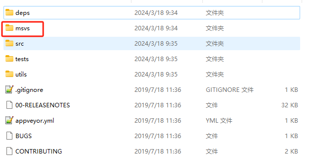

基本逻辑：GateServer收到qt client发送的注册请求后，会调用grpc服务访问VerifyServer，然后由VerifyServer生成验证码并发送给指定邮箱，VerifyServer方将发送结果（如错误信息）返回给GateServer，再由GateServer将获取验证码是否成功的消息返回给客户端。

为了自动设置验证码过期，可以使用redis服务

## windows安装redis

数据库通常包括一个服务器server和用于跟server通信的客户端cli，其中server存储数据，client负责向server发出增删改查的指令来修改server存储的内容

### redis-server

windows版下载地址：[redis for windows](https://github.com/tporadowski/redis/releases)

msi或者zip任选，下载或解压完毕后去对应文件夹下的`redis.windows.conf`文件修改密码，搜索`requirepass foobared`，添加requirepass：

```ini
# requirepass foobared
requirepass 123456
```

端口号使用默认的6379，在redis安装路径下打开git bash/cmd/powershell

启动redis服务器：`./redis-server.exe ./redis.windows.conf`（笔者大部分时间使用的git bash，所以使用/而不是\，如果你喜欢windows cmd或powershell，就使用\）

启动redis客户端：`./redis-cli.exe -p 6379`

然后使用`auth 123456`认证登录redis服务器

### hiredis（如果想直接使用redis++请跳过本章和对应的封装）

由于我们需要在代码中连接redis服务，相当于使用客户端跟redis server进行连接，所以需要有对应语言配套的借口，hiredis是一个由C语言编写的redis-client接口，提供了必要的redis相关操作

hiredis的下载地址有多个，如果只考虑在windows下使用可以考虑使用微软的hiredis（但长时间未更新，并且会和底层的socket有命名冲突）：[microsoft-redis](https://github.com/microsoftarchive/redis)

推荐使用[windows-redis: redis3.0 windows 版本，解决和ws32库冲突的问题](https://gitee.com/secondtonone1/windows-redis)，直接git clone或者下载zip文件解压

1. 进入解压后的msvs文件夹，用visual studio打开其中sln项目



2. 生成hiredis和Win32_Interop项目，在生成之前，设置项目属性为Debug x64并在代码生成中设置运行库为多线程调试dll（MDD）模式：

   

3. 之后在sln目录下会生成Debug文件夹，找到里面的`hiredis.lib`和`Win32_Interop.lib`

4. 在`D:/MinGW`下新建一个`redis_compile`文件夹，将原sln所在的`windows-redis`中的`deps`文件夹复制到`redis_compile`文件夹下，并新建lib文件夹，将第3步的两个lib复制进来

5. 在项目的`third_party.cmake`中添加hiredis的内容：

   ```cmake
   # redis-windows
   set(REDIS_ROOT "D:/MinGW/redis_compile")
   include_directories(${REDIS_ROOT}/deps/hiredis)
   
   set(REDIS_LIB_DIR ${REDIS_ROOT}/lib)
   set(REDIS_LIB_NAME
           hiredis
           Win32_Interop
   )
   ```

6. 最后在链接可执行文件时：

   ```cmake
   target_link_directories(server PRIVATE
           ${REDIS_LIB_DIR}
   )
   target_link_libraries(server PRIVATE
           ${REDIS_LIB_NAME}
   )
   ```

## c++封装hiredis

新建`redis_manager.h`和`redis_manager.cpp`文件

### RedisPool

`redisContext`是连接redis-server后返回的连接，而且必须由hiredis库中的`redisFree`函数来释放，想要使用智能指针需要提前封装`RedisContextDeleter`，池就没有什么好介绍的，固定连接数，互斥取出并返回连接：

```c++
#include <hiredis.h>
#include <queue>
struct RedisContextDeleter {
    void operator()(redisContext* c) const {
        if (c != nullptr) {
            std::cout << "try to free redis connection" << std::endl;
            redisFree(c);
        }
    }
};

// 多线程下, 在不对connection做线程安全处理的情况下, 使用单个conn会引起事务的混乱
class RedisConnPool {
public:
    using redisContextPtr = std::unique_ptr<redisContext, RedisContextDeleter>;
    RedisConnPool(size_t pool_size, std::string ip, int port, std::string pass);
    ~RedisConnPool();
    redisContextPtr getRedisContext();
    void returnRedisContext(redisContextPtr context);
    void close();
private:
    std::atomic<bool> stop_;
    size_t pool_size_;
    std::string ip_;
    int port_;
    std::queue<redisContextPtr> conns_;
    std::mutex mutex_;
    std::condition_variable cond_;
};
// .cpp
RedisConnPool::RedisConnPool(size_t pool_size, std::string ip, int port, std::string pass) :
    pool_size_(pool_size), ip_(ip), port_(port) {
    for (size_t i = 0; i < pool_size_; i++) {
        redisContextPtr context(redisConnect(ip.c_str(), port));
        if (context == nullptr || context->err != 0) {
            continue;
        }
        RedisManager::RedisCmdRAII cmd(context.get(), "auth %s", pass.c_str());
        if (cmd.reply == nullptr || cmd.reply->type == REDIS_REPLY_ERROR) {
            std::cout << "redis pool try [AUTH " << pass << "] failed" << std::endl;
            continue;
        }
        // std::cout << "redis pool try [AUTH " << pass << "] success" << std::endl;
        conns_.push(std::move(context));
    }
}

RedisConnPool::~RedisConnPool() {
    close();
    std::cout << "RedisConnPool::~RedisConnPool" << std::endl;
}

RedisConnPool::redisContextPtr RedisConnPool::getRedisContext() {
    std::unique_lock<std::mutex> lock(mutex_);
    cond_.wait(lock, [this]() {
        if (stop_) {
            return true;
        }
        return !conns_.empty();
    });
    if (stop_) {
        return nullptr;
    }
    redisContextPtr context = std::move(conns_.front());
    conns_.pop();
    return context;
}

void RedisConnPool::returnRedisContext(redisContextPtr context) {
    std::lock_guard<std::mutex> lock(mutex_);
    if (stop_) {
        return;
    }
    conns_.push(std::move(context));
    cond_.notify_one();
}

void RedisConnPool::close() {
    stop_ = true;
    {
        std::unique_lock<std::mutex> lock(mutex_);
        std::cout << conns_.size() << std::endl;
        while (!conns_.empty()) {
            auto conn = std::move(conns_.front());
            conns_.pop();
        }
    }
    cond_.notify_all();
}
```

### RedisManager

在管理类里封装可能用到的redis操作，有关redis的相关操作可以参考：[Redis 键(key) | 菜鸟教程](https://www.runoob.com/redis/redis-keys.html)

在hiredis中，使用`redisCommand(redisContext *, const char *format, ...)`来执行对应的操作，里面的`const char* format, ...`类似`printf`，是C语言中的可变参数列表，代码中额外使用一层`RedisCmdRAII`进行封装，目的是自动释放`reply`指针

```c++
class RedisManager : public Singleton<RedisManager> {
    friend class Singleton<RedisManager>;
    friend class RedisConnPool;
private:
    // 避免代码中重复的释放
    struct RedisCmdRAII {
        RedisCmdRAII(redisContext *context, const char* cmd, ...) {
            reply = nullptr;
            va_list args;
            va_start(args, cmd);
            // 使用vCommand处理参数列表
            reply = static_cast<redisReply *>(redisvCommand(context, cmd, args));
            va_end(args);
        }
        ~RedisCmdRAII() {
            if (reply) {
                freeReplyObject(reply);
            }
            reply = nullptr;
        }
        redisReply *reply;
    };
public:
    ~RedisManager();
    // bool connect(const std::string& host, int port);
    bool get(const std::string& key, std::string& value);
    bool set(const std::string& key, const std::string& value);
    bool auth(const std::string& pass);
    bool lpush(const std::string& key, const std::string& value);
    bool lpop(const std::string& key, std::string& value);
    bool rpush(const std::string& key, const std::string& value);
    bool rpop(const std::string& key, std::string& value);
    bool hset(const std::string& key, const std::string & hkey, const std::string& value);
    bool hset(const char* key, const char* hkey, const char* hvalue, size_t hvaluelen);
    std::string hget(const std::string &key, const std::string &hkey);
    bool del(const std::string &key);
    bool existsKey(const std::string &key);
    void close();
private:
    RedisManager();
    // redisContext *context;
    std::unique_ptr<RedisConnPool> conn_pool_;
};
// 设置一个键值对key - value
bool RedisManager::set(const std::string& key, const std::string& value) {
    auto ctx = conn_pool_->getRedisContext();
    RedisCmdRAII cmd(ctx.get(), "SET %s %s", key.c_str(), value.c_str());
    if (cmd.reply == nullptr ||
        !(cmd.reply->type == REDIS_REPLY_STATUS &&
            (strcmp(cmd.reply->str, "OK") == 0) || strcmp(cmd.reply->str, "ok") == 0)) {
        conn_pool_->returnRedisContext(std::move(ctx));
        std::cout << "redis [SET " << key << " = "<< value << "] failed" << std::endl;
        return false;
    }
    conn_pool_->returnRedisContext(std::move(ctx));
    std::cout << "redis [SET " << key << " = "<< value << "] success" << std::endl;
    return true;
}
// cpp
// 以set和get为例
// 取出key对应的value
bool RedisManager::get(const std::string &key, std::string &value) {
    auto ctx = conn_pool_->getRedisContext();
    RedisCmdRAII cmd(ctx.get(), "GET %s", key.c_str());
    if (cmd.reply == nullptr || cmd.reply->type != REDIS_REPLY_STRING) {
        conn_pool_->returnRedisContext(std::move(ctx));
        std::cout << "redis [GET " << key << "] failed" << std::endl;
        return false;
    }
    value = cmd.reply->str;
    conn_pool_->returnRedisContext(std::move(ctx));
    std::cout << "redis [GET " << key << "] value is: " << value << std::endl;
    return true;
}
// ...其他函数类似
```

### 测试Redis管理类

```c++
void TestRedisMgr() {
    assert(RedisManager::getInstance()->auth("123456"));
    assert(RedisManager::getInstance()->set("blogwebsite","llfc.club"));
    std::string value="";
    assert(RedisManager::getInstance()->get("blogwebsite", value) );
    assert(RedisManager::getInstance()->get("nonekey", value) == false);
    assert(RedisManager::getInstance()->hset("bloginfo","blogwebsite", "llfc.club"));
    assert(RedisManager::getInstance()->hget("bloginfo","blogwebsite") != "");
    assert(RedisManager::getInstance()->existsKey("bloginfo"));
    assert(RedisManager::getInstance()->del("bloginfo"));
    assert(RedisManager::getInstance()->del("bloginfo"));
    assert(RedisManager::getInstance()->existsKey("bloginfo") == false);
    assert(RedisManager::getInstance()->lpush("lpushkey1", "lpushvalue1"));
    assert(RedisManager::getInstance()->lpush("lpushkey1", "lpushvalue2"));
    assert(RedisManager::getInstance()->lpush("lpushkey1", "lpushvalue3"));
    assert(RedisManager::getInstance()->rpop("lpushkey1", value));
    assert(RedisManager::getInstance()->rpop("lpushkey1", value));
    assert(RedisManager::getInstance()->rpop("lpushkey1", value));
    assert(RedisManager::getInstance()->rpop("lpushkey2", value)==false);
    RedisManager::getInstance()->close();
}
```

**可能由于封装不当的原因，在main中执行return 0之前需要手动调用RedisManager的close来关闭内部连接池释放redis连接资源，另一个方法是将单例模板类的实例不使用shared_ptr管理而是直接使用模板类实例管理，即static T instance，目前未找到该bug的具体原因**

## 重新编写CMake

### 更方便的配置三方库

之前`third_party.cmake`中将`jsoncpp`的源码一起编入了工程文件中，其他库多为本地安装后再导入，除了一些大型库如boost，grpc，其他小型库管理起来实在较为麻烦，而且要不断配置包含目录和库目录的绝对根路径，下面使用CMake自带的命令来导入一些小的三方库

#### jsoncpp

1. 首先将`third_party`文件夹下的jsoncpp-1.9.6删除，使用clone命令下载到文件夹中：

   `git@github.com:open-source-parsers/jsoncpp.git`

2. 然后在项目根目录下使用命令将jsoncpp作为该项目的依赖：

   `git submodule add https://github.com/open-source-parsers/jsoncpp.git server/third_party/jsoncpp`

   git submodule有一个缺点是其会把远程所有的commit全部down下来，不过之后也方便版本切换

3. 修改`third_party.cmake`中的jsoncpp内容：

   ```cmake
   # jsoncpp
   message("-- Loading jsoncpp...")
   include(FetchContent)
   FetchContent_Declare(
           jsoncpp
           SOURCE_DIR ${PROJECT_SOURCE_DIR}/third_party/jsoncpp
   )
   FetchContent_MakeAvailable(jsoncpp)
   message("-- jsoncpp include dir: " "${jsoncpp_SOURCE_DIR}")
   ```

   解释： 在 CMake 3.11 中新增了一个叫做 **FetchContent** 的工具。FetchContent 用于在 CMake 跑脚本配置项目的时候即时下载一些文件，也是适用于**源码发布**的项目。下载目标可以是 Git 仓库的某个 commit，也可以是某个 URL 下的代码压缩包，但它们的内容都必须是 CMake 定义的项目——根目录都必须有 CMakeLists.txt 。

   FetchContent 简单来说分为两步：**声明**（declare）和**预备**（make available）:

   ```cmake
   # 引用 FetchContent 模块。
   include(FetchContent)
   # 声明 googletest 的位置和下载方式（git）。这一步不涉及网络。
   FetchContent_Declare(
     jsoncpp
     GIT_REPOSITORY https://github.com/open-source-parsers/jsoncpp.git
     GIT_TAG        ca98c98457b1163cca1f7d8db62827c115fec6d1 #对应的commit
   )
   # 下载并解压。
   FetchContent_MakeAvailable(googletest)
   ```

   使用 FetchContent 下载的项目会被解压释放到 `build/_deps/googletest-src`，并自动使用 `add_subdirectory` 包含到当前的环境里。之后按照项目的一个子项目进行构建，这里使用SOURCE_DIR是因为国内网络问题，需要配置CMAKE代理，所以和git submodule混用，git的代理比较好配置，所以先用git submodule将依赖down下来，再用FetchContent导入，比较清晰

#### redis++

和jsoncpp类似，但redis++本身依赖hiredis，所以需要先配置hiredis然后填充redis++的CMAKE变量：

```c++
# The following redis project will be loaded as dynamic libraries
# Download Hiredis, upon which Redis Plus Plus depends and use local dir.
message("-- Loading hiredis...")
FetchContent_Declare(
        hiredis
        SOURCE_DIR     ${PROJECT_SOURCE_DIR}/third_party/hiredis
)
message("-- hiredis include dir: " "${hiredis_SOURCE_DIR}")
FetchContent_MakeAvailable(hiredis)

# Download the Redis binding.
message("-- Loading redis++")
FetchContent_Declare(
        redis_plus_plus
        SOURCE_DIR      ${PROJECT_SOURCE_DIR}/third_party/redis-plus-plus
)
message("-- redis++ include dir: " "${redis++_SOURCE_DIR}")
# Pre-fill the include and library paths so that Redis++ does not search for them.
set(CMAKE_INCLUDE_PATH "${CMAKE_INCLUDE_PATH};${hiredis_SOURCE_DIR}")
set(hiredis_INCLUDE_DIRS "${PROJECT_SOURCE_DIR}/third_party")
set(HIREDIS_HEADER "${PROJECT_SOURCE_DIR}/third_party")
set(TEST_HIREDIS_LIB "${CMAKE_BINARY_DIR}/bin/hiredisd.lib")
set(HIREDIS_LIB "${CMAKE_BINARY_DIR}/bin/hiredisd.lib")

FetchContent_MakeAvailable(redis_plus_plus)
```

#### googletest

与上面类似：

```c++
# gtest
message("-- Loading GoogleTest...")
FetchContent_Declare(
        googletest
        SOURCE_DIR     ${PROJECT_SOURCE_DIR}/third_party/googletest
)
message("-- GoogleTest include dir: " "${gtest_SOURCE_DIR}")
FetchContent_MakeAvailable(googletest)
```

至于其他的boost，grpc本质上可以像上面配置，但由于源码文件实在过大，作为子项目编译太大而且耗时，所以仍然保留本地的方式，之后看看使用vcpkg的时候能否进一步优化

### vcpkg

windows上尝试使用微软的第三方库管理工具`vcpkg`也是一个不错的选择，不过本人目前并没有使用，之后更新项目时也许会考虑，具体的`vcpkg`简易安装使用教程如下：

[拥抱垃圾 CMake：4. 外部依赖 - 知乎](https://zhuanlan.zhihu.com/p/675318633)

上面提到的两种引入第三方库的方式（git submodule和Fetch_Content）本质是将第三方库作为项目的一个子项目进行构建，在编译主项目之前，会先编译子项目然后再链接到主项目当中，vcpkg和对应find_packge则采用预编译+链接使用的方式，提前编译完成，推荐生产环境使用

### 利用redis++自带的线程池

在使用了redis++之后，redis管理类的实现就变得很简单了，注意的是要使用sw::redis::Redis来创建操作redis的对象，并在其中设置连接配置和池配置，之后每次调用返回该实例，当不同线程调用该实例时，会自动触发该里面连接池的连接而不发生阻塞，保证每一次操作（set/get...）都使用一个连接完成，如果池内连接被用完了，那么实例进行的操作则会暂时阻塞：

```c++
#include <hiredis.h>
#include <queue>
#include <sw/redis++/redis.h>

#include "singleton.h"

class RedisManager : public Singleton<RedisManager> {
    friend class Singleton<RedisManager>;

public:
    ~RedisManager();
    sw::redis::Redis& getRedis();
private:
    RedisManager();
    std::unique_ptr<sw::redis::Redis> redis_conn;
};
// cpp
RedisManager::RedisManager() {
    auto config = Config::getInstance();
    std::string redis_host = (*config)["Redis"]["Host"].asString();
    int redis_port = (*config)["Redis"]["Port"].asInt();
    std::string redis_pass = (*config)["Redis"]["Pass"].asString();

    sw::redis::ConnectionOptions conn_options;
    conn_options.host = redis_host;
    conn_options.port = redis_port;
    conn_options.password = redis_pass;

    sw::redis::ConnectionPoolOptions pool_options;
    pool_options.size = 200; // redis连接数
    pool_options.wait_timeout = std::chrono::milliseconds(500); // 请求一个连接的超时时间
    redis_conn = std::make_unique<sw::redis::Redis>(conn_options, pool_options);
    std::cout << "Redis pool initialized with size: " << pool_options.size << std::endl;
}

RedisManager::~RedisManager() {
    std::cout << "RedisManager::~RedisManager" << std::endl;
}

sw::redis::Redis &RedisManager::getRedis() {
    return *redis_conn;
}
```

## VerifyServer使用redis

npm下载redis客户端：

`npm install ioredis`

### redis.js

```js
const config_module = require('./config')
const Redis = require("ioredis")

// 创建redis客户端
const RedisCli = new Redis({
    host: config_module.redis_host, // Redis server host
    port: config_module.redis_port, // Redis server port
    password: config_module.redis_passwd,
});

// 监听错误信息, 比如connect error
RedisCli.on("error", function(err) {
    console.log("Redis client connect error!");
    RedisCli.quit();
});

// redis get
async function RedisGet(key) {
    try{
        const result = await RedisCli.get(key);
        if (result === null) {
            console.log("Redis-cli: try to get <", key, "> from Redis, but not found");
            return null;
        }
        console.log("Redis-cli: get <", key, "> success, value is ", result);
        return result;
    } catch(error) {
        console.log("Redis-cli get error: ", error);
        return null;
    }
}
// redis exists
async function RedisExists(key) {
    try{
        const result = await RedisCli.exists(key);
        if (result === 0) {
            console.log("Redis-cli: ", key, "is not exist");
            return null;
        }
        console.log("Redis-cli: <", key, "> exists");
        return result;
    } catch(error) {
        console.log("Redis-cli exists error: ", error);
        return null;
    }
}
// redis set
async function RedisSetWithTime(key, value, expireTime) {
    try{
        await RedisCli.set(key, value);
        await RedisCli.expire(key, expireTime);
        console.log("Redis-cli: set <", key, "> success, timer has ", expireTime, " left");
        return true;
    } catch(error) {
        console.log("Redis-cli set error: ", error);
        return false;
    }
}

function Quit() {
    RedisCli.quit();
}

module.exports = {RedisGet, RedisExists, RedisSetWithTime, Quit}
```

### 更新server.js

```js
// 额外引入redis
const redis_module = require('./redis')

// 修改GetVerifyCode
async function GetVerifyCode(call, callback) {
    console.log("email is ", call.request.email)
    try {
        // 获取验证码之前首先查询redis中有没有缓存
        let vCode = await redis_module.RedisGet(const_module.code_prefix + call.request.email);
        let uniqueId = vCode;
        if (vCode == null) {
            uniqueId = uuidv4();
            if (uniqueId.length > 6) {
                uniqueId = uniqueId.substring(0, 6);
            }
            // 设置缓存120秒
            let setFlag = await redis_module.RedisSetWithTime(
                const_module.code_prefix + call.request.email, 
                uniqueId,
                120
            )
            // 设置失败
            if (!setFlag) {
                callback(null, {
                    email: call.request.email,
                    error: const_module.Errors.REDISERR
                });
                return;
            }
        }
        console.log("Verify code for ", call.request.email, " is ", uniqueId);
        let text_str = '您的验证码为' + uniqueId + '请2分钟内完成注册'
        //发送邮件
        let mailOptions = {
            from: 'xquank@163.com',
            to: call.request.email,
            subject: '验证码',
            text: text_str,
        };
        let send_res = await emailModule.SendMail(mailOptions);
        console.log("send res is ", send_res)
        callback(null, {
            email: call.request.email,
            error: const_module.Errors.Success
        });
    } catch (error) {
        console.log("catch error is ", error)
        callback(null, {
            email: call.request.email,
            error: const_module.Errors.Exception
        });
    }
}
```

