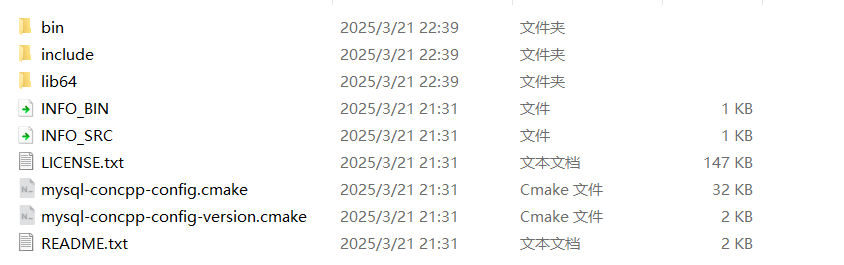

## MySQL安装

[MySQL Community Downloads](https://dev.mysql.com/downloads/)

MySQL Community Server和MySQL Installer for Windows任选一即可，同时下载Connector/C++（msi或直接下载zip压缩包）

下载完毕后将mysql的bin目录添加到环境变量

找到`my.ini`文件（没有就在mysql根目录创建一个），查找并修改（可选）配置：

```ini
[mysqld]
# 设置3308端口
port=3308
# 设置mysql的安装目录 ---这里输入你安装的文件路径----
basedir=D:\cppsoft\mysql
# 设置mysql数据库的数据的存放目录
datadir=D:\mysql\data
# 允许最大连接数
max_connections=200
# 允许连接失败的次数。
max_connect_errors=10
# 服务端使用的字符集默认为utf8
character-set-server=utf8
# 创建新表时将使用的默认存储引擎
default-storage-engine=INNODB
# 默认使用“mysql_native_password”插件认证
#mysql_native_password
default_authentication_plugin=mysql_native_password
[mysql]
# 设置mysql客户端默认字符集
default-character-set=utf8
[client]
# 设置mysql客户端连接服务端时默认使用的端口
port=3308
default-character-set=utf8
```

之后就是第一次运行mysql，一般是root用户，设置密码等

### Navicat

一个连接mysql-server的GUI客户端工具

个人使用或寻找破解版，15,16,17版本都可以

[网盘下载](https://pan.baidu.com/s/10jApYUrwaI19j345dpPGNA?pwd=77m2)

### Mysql Connector C++

mysql客户端库，可以让用户使用c++代码模拟客户端与mysql-server进行通信

项目目前还是debug环境，所以先下载mysql-connector的debug zip包

在库文件目录中解压该包



`include`文件夹和`lib64/debug`和`lib64/debug/vs14`对应着头文件和动态库（dll）目录和库目录，库目录下的lib文件是我们所需要的实际库文件，同时记得将dll文件复制一份到项目的可执行文件夹下

修改`third_party.cmake`：

```cmake
# mysql-connector
message("-- Loading mysql-connector...")
set(Mysql_connector_ROOT "实际的mysql-connector根路径")
set(Mysql_connector_INCLUDE_DIRS "${Mysql_connector_ROOT}/include")
set(Mysql_connector_LIB_DIRS "${Mysql_connector_ROOT}/lib64/debug/vs14")
set(Mysql_connector_LIB_NAME
        mysqlcppconn
        mysqlcppconnx
)
include_directories(${Mysql_connector_INCLUDE_DIRS})

message("-- mysql-connector include dir: " "${Mysql_connector_INCLUDE_DIRS}")
```

在项目的cmake中添加：

```cmak
target_link_directories(项目名称 PUBLIC
        ${Mysql_connector_LIB_DIRS}
)
target_link_libraries(项目名称
        ${Mysql_connector_LIB_NAME}
)
```

之后就可以使用mysql-connector c++库来编写代码

## MySQL封装连接池

与其他连接池一样，事先准备好sql连接，然后复用，sql初始连接数不易太多，一般配置文件里都有限制，比如最多151个连接

```c++
struct SQLConn {
    SQLConn(sql::Connection *conn, int64_t last_time) :conn(conn), last_op_time_(last_time) {}
    std::unique_ptr<sql::Connection> conn;
    int64_t last_op_time_;
};
class SQLConnPool {
public:
    SQLConnPool(const std::string& url, const std::string& user, const std::string& pass,
        const std::string& schema, size_t pool_size);
    ~SQLConnPool();
    std::unique_ptr<SQLConn> getSQLConn();
    void returnSQLConn(std::unique_ptr<SQLConn> conn);
    void close();
private:
    void checkConnection();
    bool reconnect();
    std::string url_;
    std::string user_;
    std::string pass_;
    std::string schema_;    // 对应数据库的表

    std::mutex mutex_;
    std::queue<std::unique_ptr<SQLConn>> sql_pool_;
    size_t pool_size_;
    std::atomic<bool> stop_;
    std::condition_variable cond;
    std::atomic<int> failed_cnt;
    std::thread check_thread_;
};
```

### mysql connector c++基本使用

包含头文件：

```c++
#include <jdbc/mysql_driver.h>
#include <jdbc/mysql_connection.h>
#include <jdbc/cppconn/prepared_statement.h>
#include <jdbc/cppconn/resultset.h>
#include <jdbc/cppconn/statement.h>
#include <jdbc/cppconn/exception.h>
```

建立连接，设置数据库：

```c++
sql::mysql::MySQL_Driver* driver = sql::mysql::get_driver_instance();
// url_ = "tcp://127.0.0.1:3306"
auto* conn = driver->connect(url_, user_, pass_);
conn->setSchema(schema_);
```

发起查询：

```c++
// 创建statement对象
std::unique_ptr<sql::Statement> stmt_result(conn->conn->createStatement());
// 执行sql查询, 结果保存在resultset对象中
std::unique_ptr<sql::ResultSet> res(stmt_result->executeQuery("SELECT @p_status AS status, @p_id AS id;"));


```

statement的执行有三种:

1. execute()：可以执行任何语句，甚至是存储过程等
2. executeQuery()：只能执行`SELECT SHOW DESCRIPE`等查询语句
3. executeUpdate()：只能执行`INSERT UPDATE DELETE SET CREATE`等语句

### prepare statement

该类是statement的增强类，即可以带参数，比如用户搜索时输入了一个关键词，statement在查询时只能用字符串拼接处理，但是preparestatement提供更安全的方式：

```c++
std::unique_ptr<sql::PreparedStatement> stmt(
            conn->conn->prepareStatement("CALL register_user(?, ?, ?, ?, @p_status, @p_id);")
            );
// 设置存储过程的输出参数
stmt->setString(1, name);
stmt->setString(2, username);
stmt->setString(3, email);
stmt->setString(4, password);
// 执行
if (stmt->execute()) {
    std::unique_ptr<sql::ResultSet> _(stmt->getResultSet());
}
```

上面的setString将语句中的`?`占位符全部替换，并自动转义，可以防止SQL注入

### 结果集（resultset）

在执行完查询类语句后通常会有结果集，此时如果不主动消费或释放，那么该连接在执行下一条语句的时候就会报错：

`Commands out of sync; you can't run this command now`

最保险的做法就是在每一次执行语句完毕后，都使用智能指针接管结果集，当离开作用域时主动释放，就像上面代码那样

## 建表

使用Navicat连接到mysql-server，然后右键连接名新建一个数据库`chat_project`

对于用户注册功能，首先考虑如何设计User表（table）

参考steam的设计，大致如下：

1. 用户名（username）：可重复

2. 账户名（uid）：不可重复，唯一

3. 邮箱（email）：可以使用同一个邮箱创建多个账户（可以设限制也可以不设），在有了一些基础要求后，可以直接查ai具体的sql语句怎么编写

   ```mysql
   CREATE TABLE users (
       id BIGINT UNSIGNED AUTO_INCREMENT PRIMARY KEY,
       -- id: 内部唯一标识符，主键，自增长，无业务含义，通常用于内部关联和索引。
       -- BIGINT UNSIGNED: 保证足够大的范围，且无负数。
   
       uid VARCHAR(255) NOT NULL UNIQUE,
       -- uid: 账户唯一标识符 account_name。
       -- VARCHAR(255): 
       -- NOT NULL: 不能为空。
       -- UNIQUE: 确保每个账户的uid都是唯一的。这是核心的唯一性约束。
       -- 这个uid字段将是用户在登录、查找朋友时使用的主要“账号”。
   
       username VARCHAR(255) NOT NULL,
       -- username: 用户名，可以重复。
       -- VARCHAR(255): 常用字符串长度。
       -- NOT NULL: 不能为空。
       -- 允许重复意味着你可能需要组合 uid 或 id 来唯一标识一个用户在界面上的显示。
   
       email VARCHAR(255),
       -- email: 邮箱地址。
       -- VARCHAR(255): 常用字符串长度。
       -- 允许为 NULL: 如果用户注册时可以不提供邮箱。
       -- 不加 UNIQUE: 符合“一个邮箱可以对应多个账户”的需求, 加上unique则账户和邮箱强绑定。
   
       password_hash VARCHAR(255) NOT NULL,
       -- password_hash: 存储密码的哈希值（绝不能直接存储明文密码）。
       -- VARCHAR(255): 存储哈希值（如 bcrypt 生成的哈希）通常足够。
       -- NOT NULL: 密码必须存在。
   
       created_at TIMESTAMP DEFAULT CURRENT_TIMESTAMP,
       -- created_at: 记录账户创建的时间。
   
       updated_at TIMESTAMP DEFAULT CURRENT_TIMESTAMP ON UPDATE CURRENT_TIMESTAMP
       -- updated_at: 记录账户最后更新的时间，每次更新记录时自动更新。
   );
   
   -- 添加索引 (可选但推荐，特别是对常用查询字段)
   -- 为 username 添加索引，因为即使不唯一，也可能常用作查询条件
   CREATE INDEX idx_username ON users (username);
   -- 如果 email 经常被用来查询（尽管不是唯一），也可以添加索引
   -- CREATE INDEX idx_email ON users (email);
   ```

为了之后方便查询和插入，额外加入一个邮箱和账户数量对应的表，主要用于之后事务的排他锁设计（判断当前邮箱被用来注册了多少个账户）

```mysql
CREATE TABLE email_account_counts (
    email VARCHAR(255) PRIMARY KEY, -- 邮箱地址作为主键
    count INT NOT NULL DEFAULT 0,   -- 该邮箱已注册的账户数量
    version INT NOT NULL DEFAULT 1  -- 乐观锁版本号 (可选，但推荐)
);
```

### 注册过程

mysql中的存储过程类似于c++里的函数，但mysql只能保证里面的单条语句（如select， insert是原子性的），不能够保证一个BEGIN-END内的语句都是原子性的。

下面的存储过程在user表里插入用户数据，如果同一个邮箱对应的账户名超过了3个就报错，由于uid本身是unique的，所以只有一个账户名会成功插入(id无论成功还是失败都会自增，除非改为手动自增，但那样需要重新建一个user_id表，并加入另一个排他锁，这有可能大大降低存储过程的执行效率，所以暂时不考虑)

```mysql
CREATE DEFINER=`root`@`localhost` PROCEDURE `register_user`(
    IN p_uid VARCHAR(20),
    IN p_username VARCHAR(255),
    IN p_email VARCHAR(255),
    IN p_password_hash VARCHAR(255),
    OUT p_status INT,           -- 0: 成功, 1: 邮箱账户数量超限, 2: UID重复, 3: 未知错误
    OUT p_new_user_id BIGINT    -- 如果成功，返回新用户的 ID
)
BEGIN
    DECLARE current_email_count INT DEFAULT 0;
		proc_main: BEGIN
    -- 声明专门用于处理唯一约束冲突的 HANDLER
    DECLARE EXIT HANDLER FOR 1062 -- MySQL 错误码 1062 (ER_DUP_ENTRY)
    BEGIN
        SET p_status = 2; -- UID重复
        -- 不 LEAVE PROCEDURE，让事务回滚，并由外部应用处理重试UID
    END;

    -- 通用异常处理器，确保返回错误状态
    DECLARE EXIT HANDLER FOR SQLEXCEPTION
    BEGIN
        ROLLBACK; -- 发生任何未捕获的SQL异常时回滚
        SET p_status = 3; -- 未知错误
    END;

    SET p_status = 0; -- 默认设置为成功
    SET p_new_user_id = NULL;

    START TRANSACTION; -- 开启事务

    -- Step 1: 尝试获取并锁定 email_account_counts 表中的行
    -- 如果行不存在，则插入；如果存在，则锁定并读取
    INSERT INTO email_account_counts (email, count, version)
    VALUES (p_email, 0, 1)
    ON DUPLICATE KEY UPDATE version = version; -- 仅为 ON DUPLICATE KEY UPDATE 语法需要，不实际更新 count

    -- 获取当前邮箱的账户数量，并施加排他锁 (FOR UPDATE)
    -- 这将阻塞其他尝试对同一邮箱行进行 FOR UPDATE 的事务
    SELECT count INTO current_email_count
    FROM email_account_counts
    WHERE email = p_email FOR UPDATE;

    -- Step 2: 检查邮箱账户数量是否超限
    IF current_email_count >= 3 THEN
        SET p_status = 1; -- 邮箱账户数量超限
        ROLLBACK; -- 回滚事务
        LEAVE proc_main; -- 退出存储过程
    END IF;

    -- Step 3: 插入新用户到 users 表
    INSERT INTO users (uid, username, email, password_hash)
    VALUES (p_uid, p_username, p_email, p_password_hash);

    SET p_new_user_id = LAST_INSERT_ID();

    -- Step 4: 更新 email_account_counts 表的计数
    UPDATE email_account_counts
    SET count = count + 1
    WHERE email = p_email;

    COMMIT; -- 提交事务
	
		END proc_main;
END
```

## MySQLDAO

**DAO**: Data Access Object, 将业务逻辑代码和数据访问分离，换言之，外部只调用mysql类给出的逻辑接口，不关心逻辑的具体实现

```c++
class MySQLDAO {
public:
    MySQLDAO(const std::string& url, const std::string& user, const std::string& pass,
        const std::string& schema, size_t pool_size);
    ~MySQLDAO();
    std::pair<ErrorCodes, int> userRegister(const std::string &name, const std::string& email, const std::string &password);
private:
    std::unique_ptr<SQLConnPool> conn_pool_;
};

std::pair<ErrorCodes, int> MySQLDAO::userRegister(const std::string &name, const std::string &email, const std::string &password) {
    auto conn = conn_pool_->getSQLConn();
    Defer defer([this, &conn]() {
        conn_pool_->returnSQLConn(std::move(conn));
    });
    try {
        if (conn == nullptr) {
            return {SQL_ERROR, -1};
        }
        size_t email_loc = email.find('@');
        std::string username = email.substr(0, email_loc);
        // 调用已写好的存储过程
        std::unique_ptr<sql::Statement> stmt_init(conn->conn->createStatement());
        // 提前设置会话变量
        if (stmt_init->execute("SET @p_status = 0, @p_id = 0")) {
            std::unique_ptr<sql::ResultSet> _(stmt_init->getResultSet());
        }

        std::unique_ptr<sql::PreparedStatement> stmt(
            conn->conn->prepareStatement("CALL register_user(?, ?, ?, ?, @p_status, @p_id);")
            );
        // 设置存储过程的输出参数
        stmt->setString(1, name);
        stmt->setString(2, username);
        stmt->setString(3, email);
        stmt->setString(4, password);
        // 执行
        if (stmt->execute()) {
            std::unique_ptr<sql::ResultSet> _(stmt->getResultSet());
        }

        // 由于PreparedStatement不直接支持注册输出参数，我们需要使用会话变量或其他方法来获取输出参数的值
        std::unique_ptr<sql::Statement> stmt_result(conn->conn->createStatement());
        std::unique_ptr<sql::ResultSet> res(stmt_result->executeQuery("SELECT @p_status AS status, @p_id AS id;"));

        if (res->next()) {
            int status = res->getInt("status");
            int id = res->getInt("id");
            switch (status) {
                case 0: return {SUCCESS, id};
                case 1: return {MAIL_MAX_ERROR, -1};
                case 2: return {USER_EXIST, -1};
                case 3: return {SQL_ERROR, -1};
                default: return {SQL_ERROR, -1};
            }
        }
        return {SQL_ERROR, -1};
    } catch (sql::SQLException& e) {
        std::cout << "MySQL try to register a user, but failed: " << e.what() << std::endl;
        return {SQL_ERROR, -1};
    }
}
```

使用代码调用存储过程需要额外注意：需要先初始化两个out的变量（使用SET语句），然后再调用存储过程，最后使用SELECT语句取出其中的结果

### 封装MySQLManager

将DAO封装为全局单例，方便使用

```c++
class MySQLDAO;

class MySQLManager:public Singleton<MySQLManager> {
    friend class Singleton<MySQLManager>;
public:
    ~MySQLManager() override;
    void init(const std::string& url, const std::string& user, const std::string& pass,
        const std::string& schema, size_t pool_size);

    std::pair<ErrorCodes, int> registerUser(const std::string& name,
        const std::string &email, const std::string& password);
private:
    MySQLManager();
    std::unique_ptr<MySQLDAO> dao_;
    bool inited_;
};
```


